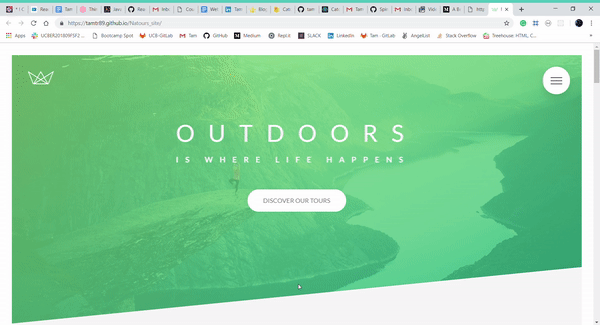

## The Natours_Booking site
Natours is a fluid layout website made using HTML5, CSS3, and SASS.

#### Click here to check out my site: https://tamtr89.github.io/Natours_site/
 
## Screenshots

## Tech/framework used
<li> Advance CSS / SASS
<li> HTML5

## Code Example

``

    

        

            

                &nbsp;
            

            <h4 class="card__heading">
                 
                The Forest Hiker
                
            </h4>

            

            

        

    

``

``

.composition {
    position: relative;

    &__photo {
        width: 55%;
        box-shadow: 0 1.5rem 4rem rgba($color-black, .4);
        

        @include respond(tab-port){
            box-shadow: 0 1.5rem 3rem rgba($color-black, .2);
        }

        &--p1 {
            left: 0;
            top: -2rem;

            @include respond(tab-port){
                top: 0;
                transform: scale(1.2);
            }
        }

        &--p2 {
            right: 0;
            top: 2rem;

            @include respond(tab-port){
                top: -1rem;
            }
        }

        &--p3 {
            left: 20%;
            top: 10rem;

            @include respond(tab-port){
                left: 1rem;
                top: 0;
                transform: scale(1.1);
            }
        }

        &:hover {
            outline: 1.5rem solid $color-primary;
            transform: scale(1.05) translateY(-.5rem);
        }
    }

    &:hover &__photo:not(:hover) {
        transform: scale(.95);
    }

``
### Acknowledgement
This project was part of the advanced CSS course by Jonas Schmedtmann from Udemy. 

# 😃 Thank you for watching!

* [LinkedIn](https://www.linkedin.com/in/tam-tran-2b1296142/) - My Profile

* [Portfolio](https://tamtr89.github.io/Tran.Portfolio/) - 💓
